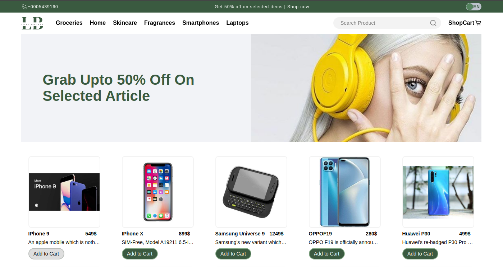
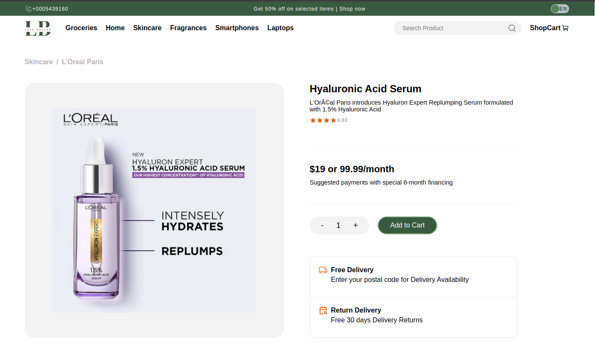
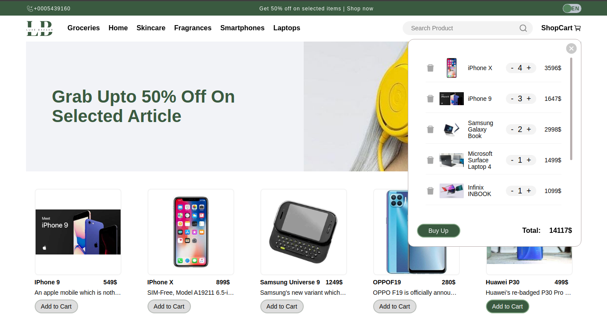
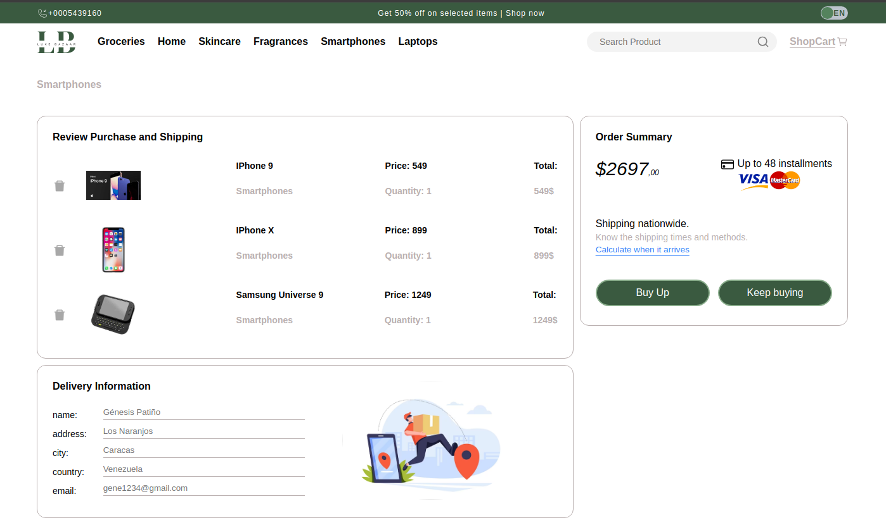

<h1 align="center"><em>Luxe Bazaar</em></h1>
</img>

   
   
   
   
   
   
   
   
   
   

<h2>Introducción</h2>

<em>Luxee Bazaar</em> es una desktop page. Una e-commers en la que podrás visualizar una lista de productos; filtrarlos por categoría y título. Podrás además, ver los detalles de un producto al seleccionarlo, aumentar o disminuir su cantidad, agregarlo al carrito de compras y eliminarlo de éste.

</img>

</img>

</img>

<h2>Descripción</h2>

<em>Luxee Bazaar</em> fue construida con Typescript y Redux Toolkit.

Se implementó React Router Dom (para el manejo de rutas). Podrás visualizar la página principal <em>Home</em>, las <em>Categorías</em> y <em>Order summary</em>.

<em>Luxee Bazaar</em>, cuenta además con:

<ul>
  <li>Un loading Skeleton para simular el estado de carga mientras se muestra la lista de productos,</li>
  <li>Un sistema de traducciones (i18next) EN/ES que podrás implementar haciendo uso de un switch</li>
</ul>

https://github.com/genepatino/luxe-bazaar/assets/62777013/4f2e0fc4-a135-4944-9b4b-7b61834dd259

A su derecha, en la sección About, encontrará el link de la aplicación.

<em>Gracias por mirar🌸</em>

<h3>Créditos por diseño a:</h3>

Musemind UI/UX Agency

<h3>Autora:
</h3>
Génesis Patiño

</img>
